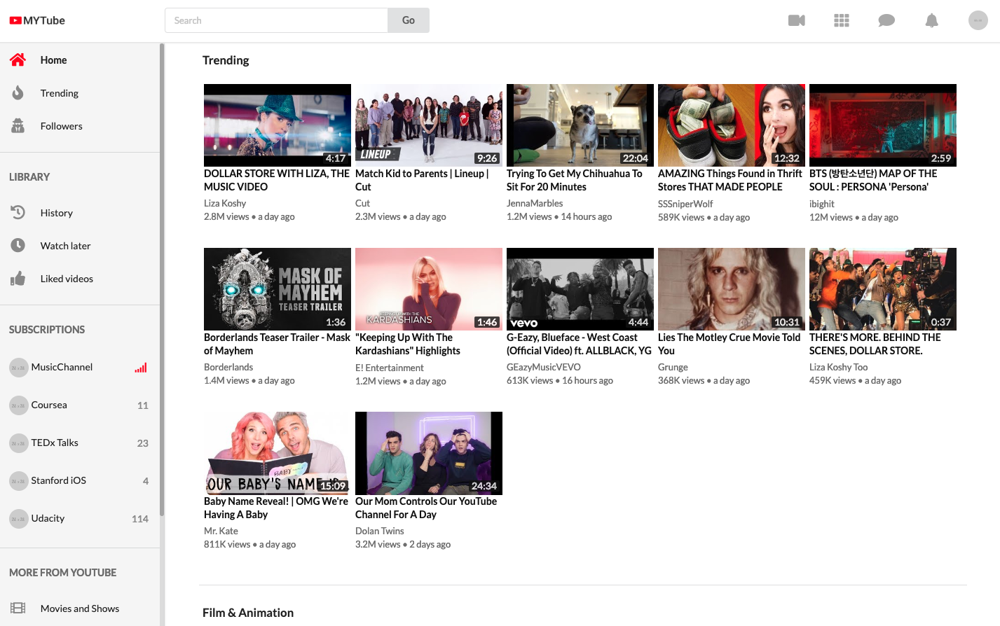
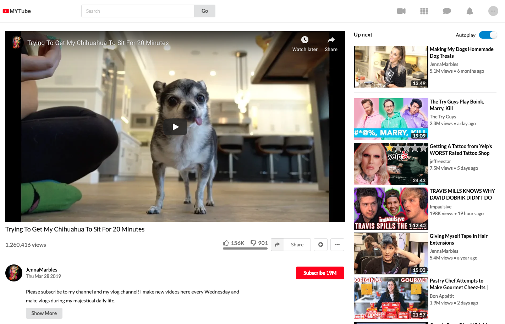
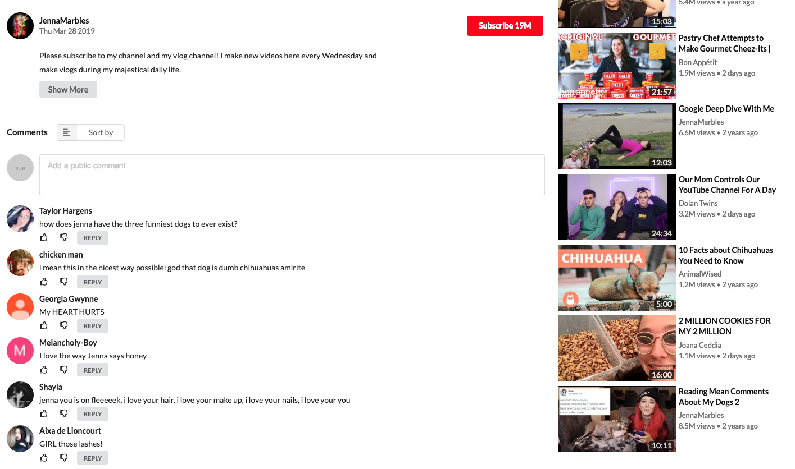

# YouTube Clone React

A Youtube-like application built in React. This leverages the Youtube data API v3 and includes initial render of latest videos, watch container with related videos, and search functionality.

> Site [YouTube Clone](https://youtube-clone11.herokuapp.com/)

# Screenshots

UI-wise this application looks **almost exactly like the original Youtube application**

It uses real data by leveraging the [Youtube Data API v3](https://developers.google.com/youtube/v3/docs/).







# Running the application

This application loads information using the [Youtube Data API v3](https://developers.google.com/youtube/v3/docs/).

To use it, you need to set up a [Youtube Data v3 API key](https://productioncoder.com/build-youtube-in-react-part-19/) and run the project with `npm` or `yarn`.

**Below is a step by step process**

## Getting Youtube Data API key

1. Head over to the [Google developers console](https://console.developers.google.com)
2. Create a new project by clicking on `Select project` drop down right next to the logo. Click the `New Project` button an give it a speaking name.
3. Select your project by choosing it in the `Select Dropdown` directly next to the logo in the header.
4. Click the `Enable APIs and Services` button
5. Search for `youtube data`
6. Click on the `Youtube Data API v3`
7. Click the blue enable button
8. In the dashboard, click `Credentials` on the left sidebar
9. Click the `Create Credential` button
10. Which API are you using: `Youtube Data API v3`
11. Where will you be calling the API from: `Web browser`
12. What data are you accessing: `Public data`
13. Click the `What credentials do I need button`
14. **Copy the API key, and paste it into `src/App.js`**

```
const API_KEY = 'AIzaxxxxxxxxxxxxxxxxxxxxxxxxxxxxxxxxxx';
```

## Installing dependencies

Install the dependencies by running

```
npm install
```

If you are using [yarn](https://yarnpkg.com/lang/en/), please run

```
yarn install
```

## Running the application

**To run the application, execute**

```
npm start
```

or with [yarn](https://yarnpkg.com/lang/en/)

```
yarn start
```

# 5 Tests

This project contains an extensive suite of tests comprised of [Jest](https://jestjs.io/) and [Enzyme](https://github.com/airbnb/enzyme).
Run all tests by executing.

```
npm test
```

You can also use [yarn](https://yarnpkg.com/lang/en/) to run the tests.

```
yarn test
```
